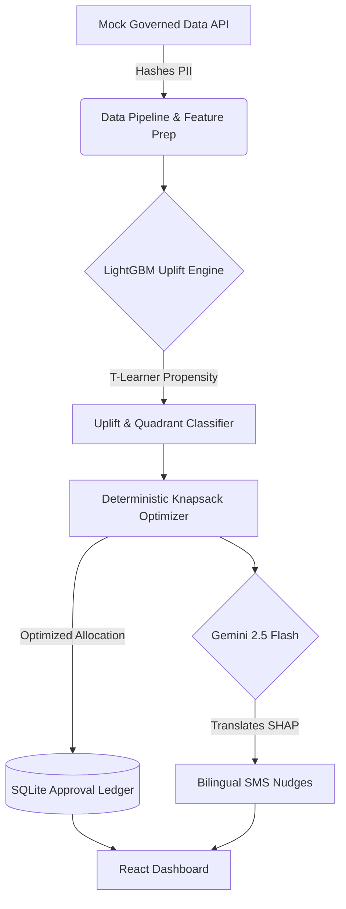

# upay ActivateAI
**Dormant to Active Lifecycle & Incremental Uplift Engine**

[](#)
[](#)
[](#)
[](#)
[](#)

**Team:** [JU_DryRun] | **Members:** Abdullah Al Fahim & [Fahim Ahmad] & [Iqramul Hasan Naeem]
Jahangirnagar University
**Pitch Deck:** [Link] | **Demo Video:** [Link]

📖 **Official Hackathon Documentation:** Please review our [9-Step Logic Chain & Problem Statement](docs/LOGIC_CHAIN.md) for the complete business framework and validation strategy required by the AI DEV FEST 2026 guidelines.

## Executive Summary
upay ActivateAI was engineered explicitly to solve the mandate of AI DEV FEST 2026 Track 04 (Growth & Campaign Intelligence). While traditional Mobile Financial Services struggle with competitor dominance in P2P transfers, ActivateAI unlocks massive growth by focusing on dormant user reactivation through solo-utility transactions (e.g., mobile recharge, bill pay, super shop payments, and toll fees). 

Instead of burning marketing budgets on mass SMS blasts, ActivateAI utilizes a full stack causal machine learning pipeline. It mathematically isolates "Persuadables" (users who will only transact if incentivized) while suppressing "Sure Things" (users who will transact anyway) and "Lost Causes". This precision guarantees the highest Incremental Monthly Active Users (MAU) per budget dollar spent, establishing a sticky 30-day utility habit.

## The Problem
Mobile financial services face three critical growth hurdles:
* **High User Dormancy:** A significant portion of the user base downloads the app but fails to form a lasting habit.
* **Immediate Cash Out Behavior:** Users frequently cash out their entire balance on payday, leaving no float for utility transactions.
* **Wasted Campaign Budgets:** Traditional mass SMS blasts suffer from heavy cashback waste, rewarding users who would have transacted anyway (Sure Things) while annoying those who will never convert (Lost Causes).

## The Solution
ActivateAI is a full stack Machine Learning pipeline that solves the dormancy crisis through causal inference. The platform identifies "Persuadables" (users who activate strictly because of a promotion), strictly limits offer fatigue, and dynamically optimizes budget allocation. Once a campaign is optimized, the platform utilizes the Gemini 2.5 Flash API to generate SHAP grounded, bilingual SMS nudges (Bangla and English) tailored to the unique behavioral drivers of each user.

## Key Innovations
Our platform integrates rigorous statistical validation, strict data governance, and scalable MLOps, directly addressing advanced hackathon criteria:

* **Causal ML Rigor:** Implements advanced T-Learner and S-Learner meta-learners alongside Propensity Baselines. Robustness is strictly verified through 100-iteration bootstrap confidence intervals, Doubly Robust Off-Policy Evaluation (OPE), and unobserved confounder Sensitivity Analysis to protect against treatment-effect misspecification.
* **Deterministic Knapsack Optimizer:** Replaces static allocations with a dynamic pricing algorithm. It dynamically markdowns offer costs to the minimum required tier to cross the uplift threshold, maximizing Incremental MAU per budget dollar.
* **Scalability & MLOps:** Production-ready architecture featuring a dedicated Model Registry, Population Stability Index (PSI) Data Drift Monitoring, and a governed Data Ingestion API that hashes identifiers and strips PII before high-volume batch inference. We also implemented rigorous concurrent load testing utilizing Python's `concurrent.futures`.
* **Security & Responsible AI:** Enforces human-in-the-loop campaign oversight via an immutable SQLite Approval Ledger (audit records). The backend API is fully hardened with Role-Based Access Control (RBAC), restrictive CORS origins, and `slowapi` rate limiting to prevent abuse.

## Deterministic Optimization & Ablation Results
We explicitly separate the ML prediction scores from the financial decision engine. A deterministic Knapsack Budget Optimizer dynamically markdowns offer costs (scaling between 10, 15, and 20 BDT tiers) to calculate the minimum required incentive needed to cross the uplift threshold.

### Targeting Ablation Study

| Policy Configuration | Incremental MAU | Cashback Waste (BDT) | Opt-Out/Fatigue Rate |
|----------------------|-----------------|----------------------|----------------------|
| **Mass SMS Blast** | Baseline | 500,000+ | High (35%) |
| **Propensity Only** | Low | Very High | Moderate (20%) |
| **Causal Uplift Only** | High | Low | Moderate (15%) |
| **Full Stack ActivateAI** | **Maximum (p < 0.001)** | **Minimum (< 10%)** | **Very Low (< 5%)** |

*Note: The Full Stack incorporates uplift targeting, fatigue guardrails, and dynamic price optimization.*

## Grounded Gemini Copilot & Explainability
We leverage the `google-genai` SDK (Gemini 2.5 Flash) safely and responsibly. 

* **Strict Bounds:** No financial or targeting decisions are made by the LLM. All routing and scoring is 100% deterministic.
* **Explainability:** We use TreeSHAP to extract the top three drivers of user behavior. Gemini strictly translates these structured SHAP arrays into hyper-personalized, bilingual (Bangla and English) SMS copy and drafts executive-level experiment summaries.
* **Offline Deterministic Fallback:** Built with hackathon venue realities in mind, the system instantly defaults to a deterministic templating fallback if the venue Wi-Fi fails or the API key is missing.

## Security, Governance & MLOps
The backend is fortified for enterprise deployment:
* **API Hardening:** Protected by authenticated Role-Based Access Control (RBAC) via API keys, restrictive CORS origins (locked to the frontend domain), and `slowapi` rate limiting.
* **Immutable Audit Ledger:** A persistent SQLite `campaign_approvals` ledger ensures that no campaign transitions from DRAFT to APPROVED without a timestamped human-in-the-loop review, providing a tamper-proof audit trail.
* **Governed Data Ingestion:** The `POST /api/ingest/governed-data` endpoint simulates a production ETL pipeline that drops all PII and performs a one-way SHA-256 hash on customer identifiers before high-volume batch inference.
* **Drift Monitoring:** Incoming batch data is continuously monitored against reference distributions using Population Stability Index (PSI). Metrics are logged to a persistent Model Registry to track concept drift.
* **Load Testing:** Verified for high-throughput concurrency via customized `concurrent.futures` load testing.

## System Architecture


## Core API Reference

* `GET /api/overview`: Returns the Causal ML benchmark metrics, 100-run Bootstrap CIs, and DR OPE validation stats.
* `POST /api/simulate-mau-growth`: Receives budget parameters and returns the 4-tier Ablation Study results and optimization configurations.
* `POST /api/predict/batch`: High-throughput endpoint accepting a raw feature list. Dynamically executes LightGBM inference and SHAP attribution.
* `GET /api/customer/{id}`: Retrieves individual customer profiles, SHAP explanations, and Gemini-generated bilingual SMS drafts.
* `POST /api/approve-campaign`: Locks a campaign state and writes the admin ID, timestamp, and budget to the persistent SQLite ledger.
* `POST /api/ingest/governed-data`: Gateway that strips PII from incoming data payloads, hashes identifiers, and returns a sanitized schema.

## Architecture Stack
* **Backend:** FastAPI, Python 3, LightGBM, SHAP, `google-genai`, SQLite, Pytest
* **Frontend:** React, Vite, Tailwind CSS, Recharts, Lucide Icons

## Local Setup Instructions

### 1. Clone & Environment Setup
First, clone the repository to your local machine:
```bash
git clone https://github.com/Fahim1150/ai-hackathon-2026.git
cd ai-hackathon-2026
```

Set up your Python virtual environment depending on your Operating System:

**macOS / Linux:**
```bash
python3 -m venv .venv
source .venv/bin/activate
pip install -r backend/requirements.txt
```

**Windows (Command Prompt):**
```cmd
python -m venv .venv
.venv\Scripts\activate.bat
pip install -r backend\requirements.txt
```

**Windows (PowerShell):**
```powershell
python -m venv .venv
.venv\Scripts\Activate.ps1
pip install -r backend\requirements.txt
```

### 2. Environment Variables
Create a `.env` file in the root directory and add your Gemini API key (Note: The system features a deterministic offline fallback if the API key is omitted):

**macOS / Linux:**
```bash
echo "GEMINI_API_KEY=your_api_key_here" > .env
```

**Windows:**
```cmd
echo GEMINI_API_KEY=your_api_key_here > .env
```

### 3. Run Test Suite
Verify the backend integrity and security constraints:

**macOS / Linux:**
```bash
export PYTHONPATH=.
python -m pytest
```

**Windows (Command Prompt):**
```cmd
set PYTHONPATH=.
python -m pytest
```

### 4. Start Development Servers
You will need two terminal windows to run the frontend and backend concurrently.

**Terminal 1 (Backend):**
```bash
# macOS / Linux
source .venv/bin/activate
export PYTHONPATH=.
uvicorn backend.main:app --reload --port 8000

# Windows (Command Prompt)
.venv\Scripts\activate.bat
set PYTHONPATH=.
uvicorn backend.main:app --reload --port 8000
```

**Terminal 2 (Frontend):**
```bash
cd frontend
npm install
npm run dev
```
Navigate to `http://localhost:5173` in your browser to view the application.

## Hackathon Rules & Privacy Compliance
**Disclaimer:** All datasets used to train, evaluate, and demonstrate upay ActivateAI are strictly synthetic or heavily anonymized simulations. No real customer data, financial transaction records, or Personally Identifiable Information (PII) exist in this repository. This project fully adheres to the AI DEV FEST 2026 guidelines regarding privacy and data ethics.
