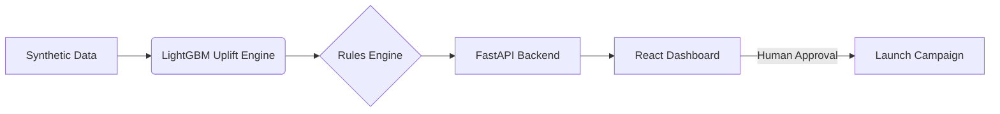

# CampaignIQ - Uplift & Next-Best-Offer Engine

> AI-driven campaign intelligence engine. Built for AI DEV FEST 2026 – AI Hackathon (DIU CPC × upay).

## 1. Project Overview
- **User:** upay Marketing & Growth Managers
- **Problem:** Untargeted campaigns waste budget on customers who would transact anyway (Sure Things) or those who react negatively to offers (Sleeping Dogs). The baseline is a simple "Response Model" that just targets likely converters.
- **Solution:** We built **CampaignIQ**, which uses 100% synthetic transaction and treatment/control data to rank customers and offers by **incremental uplift**.
- **Purpose / impact metric:** Maximize incremental conversions under budget, measured by **Cost per Incremental Transaction** and **Qini/AUUC** on a held-out test set.

## 2. Features
| Feature | How AI is used |
|---|---|
| **Uplift Modeling (T-learner)** | LightGBM classifiers model P(conversion\|treatment) vs P(conversion\|control) to isolate the true effect of each offer. |
| **Next-Best-Offer Ranking** | Ranks 5 different offers per customer based on highest predicted incremental ROI. |
| **Explainable AI (SHAP)** | Extracts SHAP feature contributions (treatment minus control) to explain *why* an offer was recommended in plain language. |
| **Fairness Check** | Compares contact rates and average uplift across regions and age bands to ensure demographic parity. |
| **Budget Optimizer** | Greedy knapsack approximation allocates fixed budget to maximize incremental profit vs an equal-split baseline. |
| **Fatigue Monitor** | Business rules and diminishing return heuristics prevent over-contacting (blocks users with 3+ offers in 30 days). |
| **Experiment Intelligence** | Compares two campaign variants via A/B test statistics (p-value, confidence intervals, lift) to guide next actions. |

## 3. Technology Stack
- **Backend:** Python 3.12, FastAPI, LightGBM (T-learner uplift), XGBoost (legacy), Scikit-Learn, Pandas, SciPy.
- **Frontend:** React 18, Vite, Tailwind CSS v4, Recharts, Lucide React, React Router.
- **Data:** 100% Synthetic data generator (`generate_synthetic.py`) outputting Parquet/CSV.

## 4. Requirements
- Python 3.11+
- Node.js 20+
- Docker and docker-compose (optional, for containerized run)

## 5. Installation & Setup
```bash
# Clone the repository
git clone <repo-url> && cd ai-hackathon-2026

# 1. Setup Backend
python -m venv .venv && source .venv/bin/activate
pip install -r backend/requirements.txt
cp .env.example .env

# 2. Generate Synthetic Data (50k users, planted effects)
python data/generate_synthetic.py

# 3. Train the Uplift Models
python -m backend.app.train

# 4. Setup Frontend
cd frontend
npm install
npm run build
cd ..
```

## 6. Run & Build

### Option A: Local Development
```bash
# Terminal 1: Backend
uvicorn backend.app.main:app --reload --port 8000

# Terminal 2: Frontend
cd frontend
npm run dev
```

### Option B: Docker Compose
```bash
docker-compose up --build
```
Access the application at `http://localhost:5173`.

## 7. Live Deployment
Can be deployed to free hosts like Render (for backend) and Vercel/Netlify (for frontend). 
- Use the `backend/Dockerfile` for the API.
- Use `frontend/Dockerfile` or Vercel's automatic React/Vite deployment for the UI.

## 8. Testing
```bash
# Run pytest for backend endpoints and business rules
pytest backend/tests -v
```

## 9. Architecture Diagram


## 10. Data & Responsible AI
- **100% Synthetic Data:** See `docs/SYNTHETIC_ASSUMPTIONS.md` for details on how effects (Persuadables, Sleeping Dogs, etc.) were planted. No real upay PII was used.
- **Explainability:** Every single recommendation shows its SHAP-derived reasons in plain English.
- **Human-in-the-Loop:** The Budget Optimizer requires a human Growth Manager to click "Approve" before any campaign is finalized. No autonomous consequential decisions are made.
- **Fairness:** The `/fairness` endpoint and UI panel actively track selection rates across hidden attributes (Region, Age) to prevent algorithmic bias.
- **AI Tools Used:** Documented fully in `docs/AI_USAGE_LOG.md`.

## 11. Post-Hackathon Validation Plan
To deploy CampaignIQ in production at upay:
1. **Data Integration:** Map real transaction history (txn_count, avg_amount) and demographics from the upay data lake.
2. **RCT Rollout:** Run a 5% holdout randomized control trial (RCT) with real offers to gather unbiased training data.
3. **Retrain:** Feed real RCT data into the LightGBM uplift pipeline.
4. **Governed Deployment:** Shadow mode for 1 month, followed by phased rollout.
